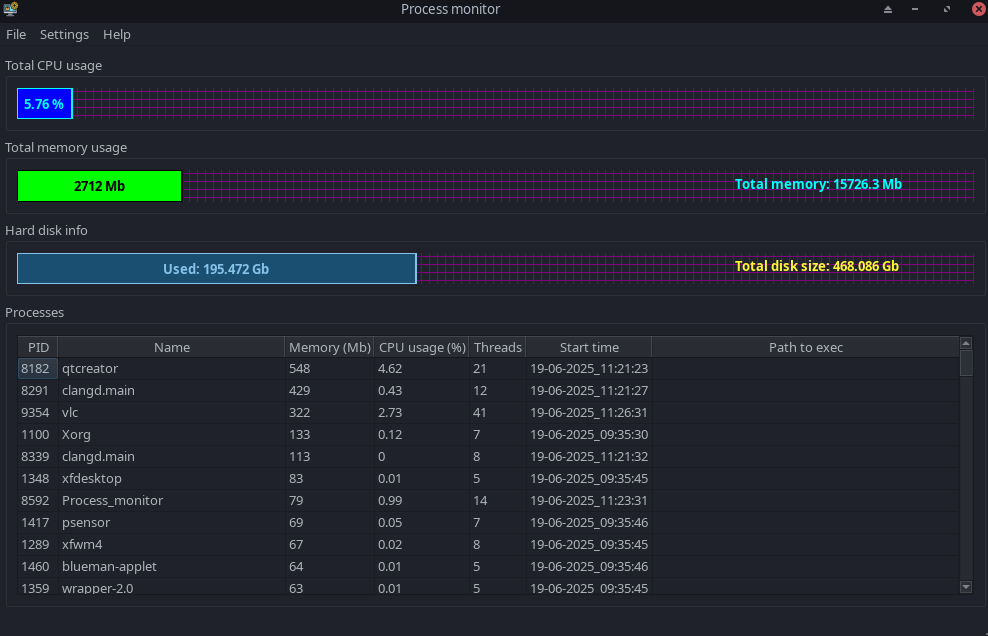

About Process monitor application
========================

Screenshots
===========

Description
===========

This program created showing active processes, used memory, CPU usage and hard disk space.

Copyright (C) 2025  Teg Miles.
Process monitor is free software: you can redistribute it and/or modify it
under the terms of the GNU General Public License as published by
the Free Software Foundation, either version 3 of the License,
or any later version.

Features
========

  * Show active processes.
  * Show total used memory.
  * Show CPU usage.
  * Show current hard disk used space.
  * An active process can be deleted through the context menu.

Authors
========

  - Teg Miles (movarocks2@gmail.com)
  - The logo icon was taken from https://www.flaticon.com/free-icon/content-management-system_2630878?term=system+monitor&page=1&position=1&origin=search&related_id=2630878 Eucalyp - Flaticon.

Requirements
============

* Qt6 (6.6.1 or newer), CMake (3.16 or newer), C++ compiler (GCC, Clang or MSVC).

One of the following operating systems:

* **Linux**: x86_64 with kernel 6.14.0 or higher.  *Manjaro 23.0.0 (or newer) recommended.*

Configuration
=============

Configuration for the application is stored in the ``Process_monitor.conf`` file or registry item
in a directory appropriate to your OS.  Refer to this table:

System     Directory
========== ==============================================
Linux, BSD ``$XDG_HOME/`` if defined, else ``~/.config/``
========== ==============================================
